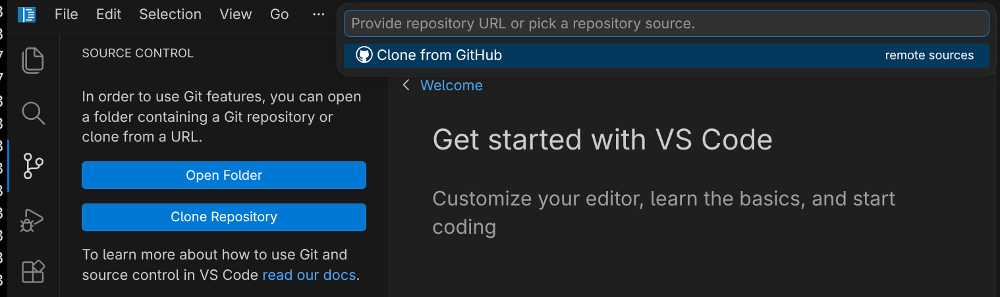
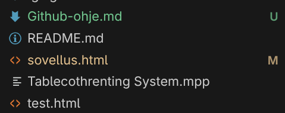
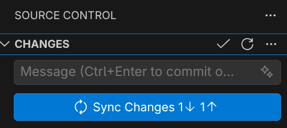
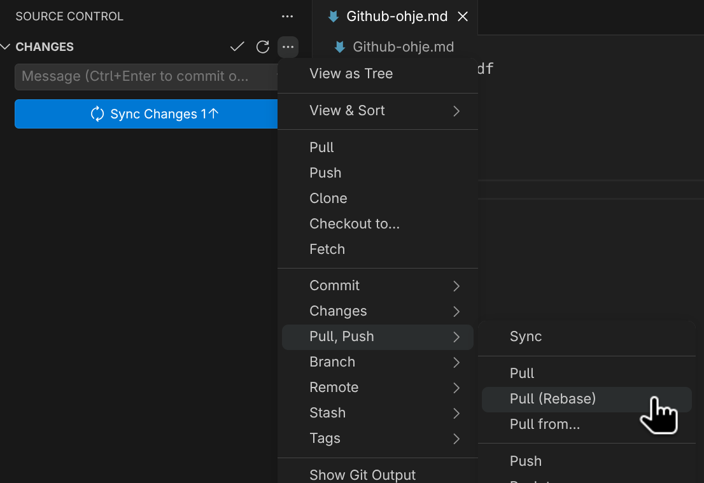

# Asennus
https://git-scm.com/install/windows

# Käyttö:

## Konsoli

## Vscode
- Sivupaneeli "Source Control" | `Ctrl + Shift + G`
- Clone Repository -> Clone from Github

- *(Noudata vscoden ohjeita ja tunnistaudu, jos et ole sitä vielä tehnyt, vaatii tunnistautumiskoodin sovelluksesta ja sähköpostista.)*
- Valitse Severi623/Pesula-sovellus -> Tietokoneen kansio mihin sovellus kopioidaan
- Nyt sivupaneelissa "Explorer" pitäisi näkyä kaikki mitä Githubissa on. 
- Muokatut tiedostot merkkautuu `M` ja uudet tiedostot merkataan `U`, nämä muutokset on vain sinun tietokoneellasi ja ne pitää erikseen lähettää githubiin. (Muista tallentaa tiedosto)

- Sivupaneelin "Source Control" taas, ne paketoidaan 'Commitiksi', siihen voi kirjoittaa kommenttina mitä muutoksia on tehnyt
- Sen jälkeen ne pitää vielä "pushata" Githubiin. Eli painamalla "Sync Changes" nappia ne yritetään ladata Githubiin.

- Jos Github repo on kerennyt päivittyä ennen kuin se commit lähetetään tulee virhe, silloin voi tehdä "Pull (Rebase)", joka lataa githubista kaikki muutokset koneellesi, että tietokone on ajan tasalla **!!Ole varovainen tässä voi menettää kaikki omat muutokset jos joku on muokannut samaa tiedostoa.**

### Branchit ja merge
Konfliktiesimerkki
# Termejä
| Termi  | Toiminto                             |
| ------ | ------------------------------------ |
| Pull   | Lataa Githubista                     |
| Push   | Työntää Githubiin                    |
| Commit | "Paketti" jossa on muutoksia koodiin |
