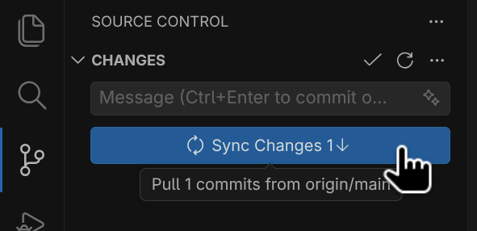
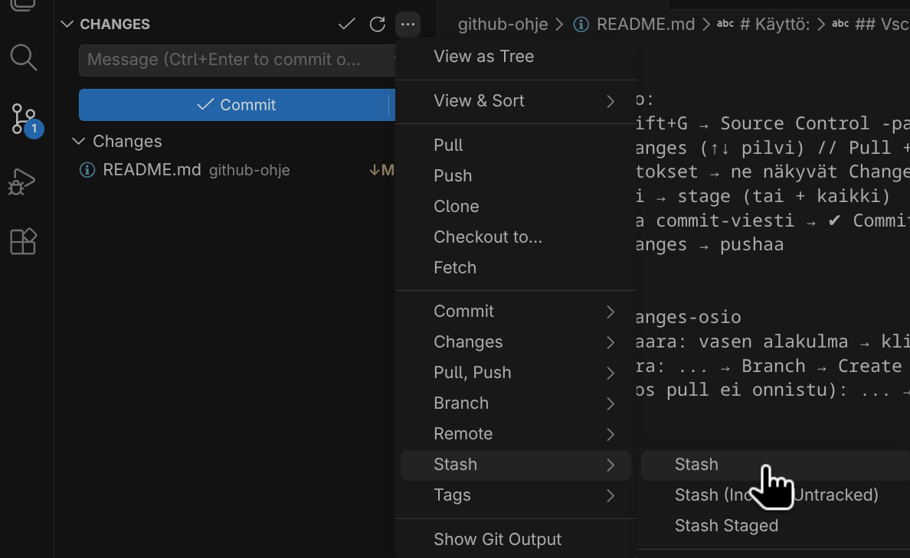
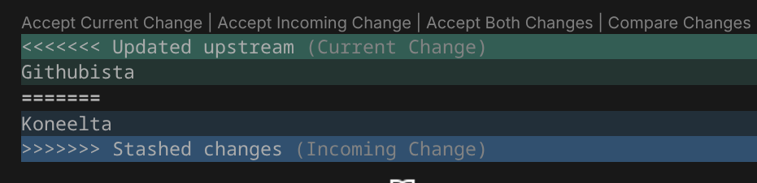
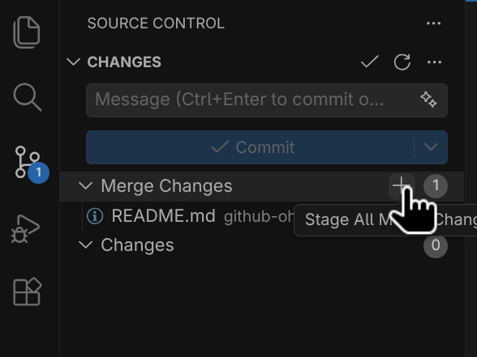
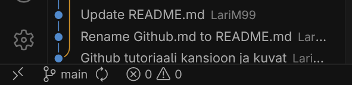
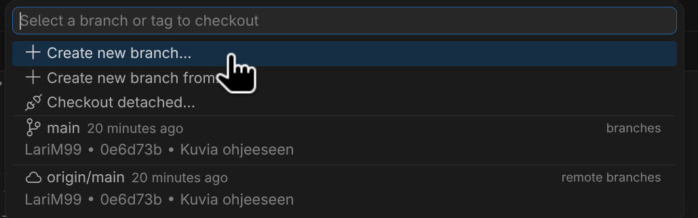
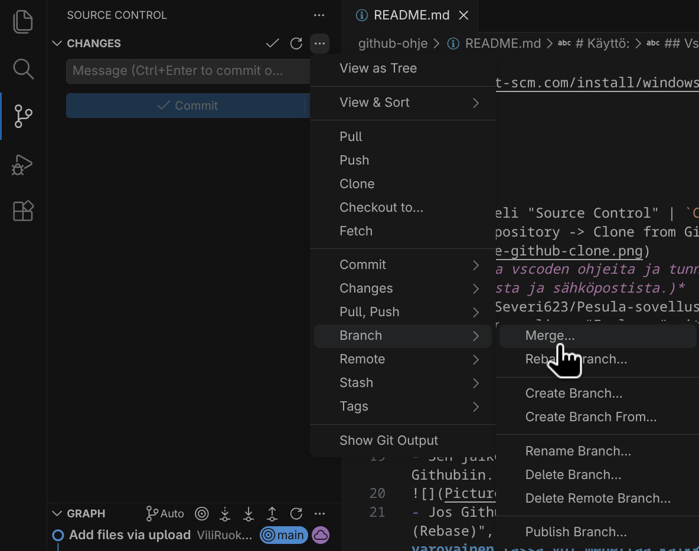
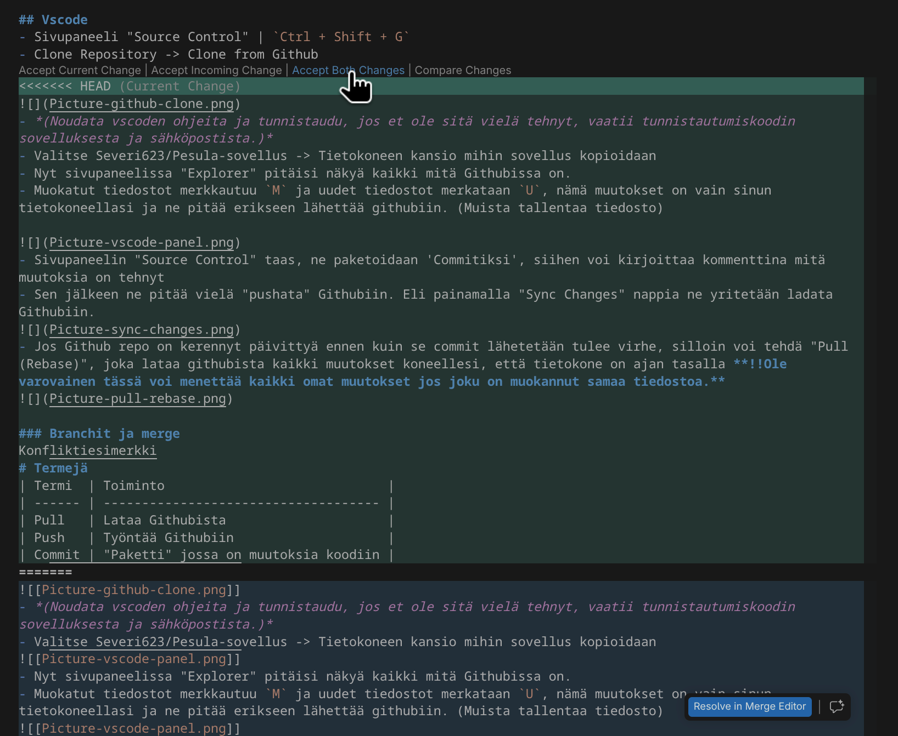

```
Idea lyhyesti:
Git on versionhallintatyökalu, joka tallentaa tehdyt muutokset.
Github on pilvipalvelu joka pitää yllä koodiprojekteja.
Kun tehdään ryhmäprojektia pitää pitää mielessä, että nämä kaksi eivät ole sama asia. 
Sinulla on siis omalla koneella git historia ja Githubissa on oma git historia,
 joita pitää synkronisoida keskenään.
```

```
Pikamuistio:
1. Ctrl+Shift+G → Source Control -paneeli 
2. Sync Changes (↑↓ pilvi) // Pull + Push kerralla (tai ... → Pull ensin)
3. Tee muutokset → ne näkyvät Changes-listassa 
4. + merkki → stage (tai + kaikki) 
5. Kirjoita commit-viesti → ✔ Commit (tai Ctrl+Enter) 
6. Sync Changes → pushaa

Suositus:
- Älä puske suoraan mainiin → feature/xxx-haara + Pull Request GitHubissa
- Vaihda haara: vasen alakulma → klikkaa branch-nimeä 
- Uusi haara: ... → Branch → Create Branch... 
- Stash (jos pull ei onnistu): ... → Stash Changes → Pop myöhemmin
```

# Vscode
## Käyttöönotto
* Sivupaneeli "Source Control" | `Ctrl + Shift + G`
* Clone Repository -> Clone from Github


* *(Noudata vscoden ohjeita ja tunnistaudu, jos et ole sitä vielä tehnyt, vaatii tunnistautumiskoodin sovelluksesta ja sähköpostista.)*
* Valitse Severi623/Pesula-sovellus -> Tietokoneen kansio mihin sovellus kloonataan
* Nyt sivupaneelissa "Explorer" pitäisi näkyä kaikki mitä Githubissa on. 
## Synkronointi:
`Ctrl + Shift + G` (Sivupaneelista Source Control) Synkronoi muutokset Githubista omalle koneelle. (Pull)



Jos omalla tietokoneella on myös lähettämättömiä muutoksia:
* `... + Stash + Stash` -> Piilottaa muokatut tiedostot
* `Sync Changes` -> Lataa Githubiin tehdyt muutokset
* `... + Stash + Pop Latest Stash` -> Tuo piilotetut tiedostot takaisin esiin.
*(Tai jos on kerennyt tehdä Commitin niin voi tehdä `... + Pull + Pull (Rebase)` ja selvittää konfliktit seuraavassa pushissa.)*



Tässä vaiheessa voi tulla konflikti, jos sama tiedosto on muuttunut sekä koneella, että Githubissa:
* Vscodessa voi valita kumman version valitsee (tai molemmat)



Kun vielä painaa Stage All Merge Changes sekä Githubin, että tietokoneen paikallinen versio on sama.



## Branchit
Branchit on haaraumia, jotka lähtee jostain git versiosta elämään omaa elämäänsä ja lopulta liitetään takaisin 'pääpolulle'.
Suositus on, että kehittäessä ohjelmistoa ei pushaa suoraa pääpolulle (master/main) vaan luo esim. backend branchin
 ja liittää sen pääpolulle vasta kun se on valmis.


Vscodessa branch joka on tällä hetkellä valittuna näkyy vasemmassa alanurkassa, tässä kuvassa 'main'



Sitä klikkaamalla saa esiin valikon josta voi valita branchin tai luoda uuden.
* kuvassa *branches (main)* tarkoittaa tietokoneella olevia haaraumia ja *remote branches (origin/main)* Githubissa olevia haaraumia.
* Samalla lailla kuin kaikki muutkin git muutokset, branchit pitää julkaista Source Controlista Githubiin.



## Muokkaus:
- Nyt voi muokata kloonatun kansion sisältöä. 
Kun muokkaa tai lisää tiedoston (muista tallentaa),
 se ilmestyy Source Controlin - Changes  -listaan. 
- Listasta voi valita (Stage) mitkä tiedostot haluaa laittaa Commitiin,
 mutta ennen kuin ne voi pushata Githubiin, listan täytyy olla tyhjä, 
 ne voi esimerkiksi Stashata `... + Stash + Stash`
- Sen jälkeen kirjoita commit viesti ja paina `Commit`.
- Commit tallentaa muutokset gitin historiaan uudeksi versioksi
 ja sen jälkeen samasta sinisestä napista pitää painaa vielä
 `Sync Changes` (Push), joka lähettää version Githubiin.


## Merge:
Kun ominaisuus on valmis, haarauma liitetään pääpolulle.
Vaihda takaisin pääpolulle vasemmasta alanurkasta (polulle mihin haluaa liittää)
Source Control -> `... + Branch + Merge` -> Valitse branch joka liitetään.
* Liittää pääpolulle kaikki haarautumassa tehdyt muutokset.



Jos esiintyy ristiriitoja, ne täytyy selvittää ennen kuin git antaa luvan mergeen. 
- vihreällä "Current change" eli mitä pääpolun versioon on muutettu haarauman versioon nähden.
- sinisellä "Incoming change" eli liitettävään haaraumaan tehdyt muutokset.



-  Source controlissa näkyy muutokset ja ne täytyy kaikki selvittää ennen kuin merge onnistuu.


-  `+` näppäin (Stage Changes) kun selvittänyt tiedoston ristiriidat. 2
# Termejä
| Termi    | Toiminto                                            |
| -------- | --------------------------------------------------- |
| Git      | Projektinhallintatyökalu                            |
| Github   | Pilvipalvelu, joka toimii gitin avulla.             |
| Pull     | Lataa Githubista                                    |
| Push     | Lähettää Githubiin                                  |
| Commit   | "Paketti" / versio, joka sisältää muutokset koodiin |
| Checkout | Branchin vaihto                                     |
| Branch   | Koodihaarauma jollekin uudelle ominaisuudelle       |
