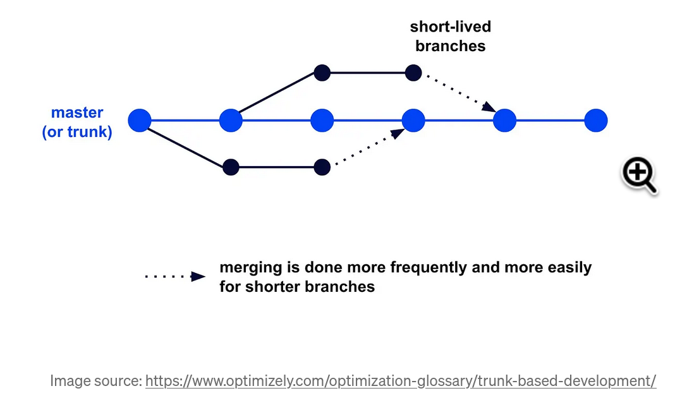
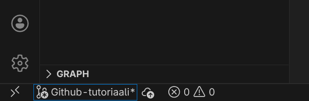
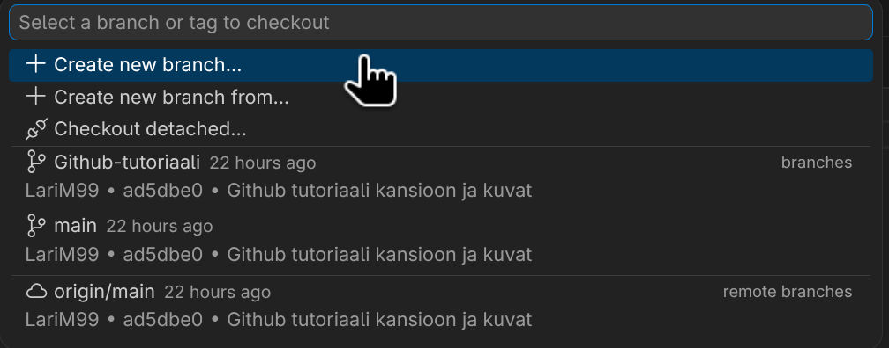

# Käyttö:
```
Pikamuistio:
1. Ctrl+Shift+G → Source Control -paneeli 
2. Sync Changes (↑↓ pilvi) // Pull + Push kerralla (tai ... → Pull ensin)
3. Tee muutokset → ne näkyvät Changes-listassa 
4. + merkki → stage (tai + kaikki) 
5. Kirjoita commit-viesti → ✔ Commit (tai Ctrl+Enter) 
6. Sync Changes → pushaa

Vinkit:
- Katso Changes-osio 
- Vaihda haara: vasen alakulma → klikkaa branch-nimeä 
- Uusi haara: ... → Branch → Create Branch... 
- Stash (jos pull ei onnistu): ... → Stash Changes → Pop myöhemmin

Suositus: 
```

## Vscode
- Sivupaneeli "Source Control" | `Ctrl + Shift + G`
- Clone Repository -> Clone from Github

- *(Noudata vscoden ohjeita ja tunnistaudu, jos et ole sitä vielä tehnyt, vaatii tunnistautumiskoodin sovelluksesta ja sähköpostista.)*
- Valitse Severi623/Pesula-sovellus -> Tietokoneen kansio mihin sovellus kopioidaan
- Nyt sivupaneelissa "Explorer" pitäisi näkyä kaikki mitä Githubissa on. 
- Muokatut tiedostot merkkautuu `M` ja uudet tiedostot merkataan `U`, nämä muutokset on vain sinun tietokoneellasi ja ne pitää erikseen lähettää githubiin. (Muista tallentaa tiedosto)


- Sivupaneelin "Source Control" taas, ne paketoidaan 'Commitiksi', siihen voi kirjoittaa kommenttina mitä muutoksia on tehnyt
- Sen jälkeen ne pitää vielä "pushata" Githubiin. Eli painamalla "Sync Changes" nappia ne yritetään ladata Githubiin.

- Jos Github repo on kerennyt päivittyä ennen kuin se commit lähetetään tulee virhe, silloin voi tehdä "Pull (Rebase)", joka lataa githubista kaikki muutokset koneellesi, että tietokone on ajan tasalla **!!Ole varovainen tässä voi menettää kaikki omat muutokset jos joku on muokannut samaa tiedostoa.**


### Branchit
- Branchit on turvallisempi tapa tuoda uusia muutoksia git projektiin.

- Ideana siis luoda oma haarauma ominaisuudelle (Frontend, varastonäkymä, etc.) ja kun se on valmis, liittää haarauma pääpolulle mergen avulla.
	- Välttää ristiriitoja repon ja kehitysympäristön välillä
	- Ei tarvitse koko ajan ladata muutoksia githubista (toki hyvä tehdä niin)
- Branchitkin voi jakautua useampaan branchiin.
- Vasemmassa alanurkassa näkyy branch jota muokkaa tällä hetkellä

- Sitä klikkaamalla voi vaihtaa tai luoda uuden branchin.
	- Branches = omalla koneella olevat haaraumat
	- Remote branches = githubissa olevat haaraumat.

- Nyt voi luoda commiteja ja työntää niitä githubiin niin kuin aiemmin, mutta ne menevät valitulle haaraumalle pääpolun sijaan.

### Merge
- Kun ominaisuus on valmis, haarauma liitetään pääpolulle ja se poistetaan.
- Vaihda takaisin pääpolulle (polulle mihin haluaa liittää)
- Valikko (kolme pistettä) -> Branch -> Merge -> Branch joka liitetään
	- (Liittää nykyiselle branchille valitun branching muutokset ja uudet tiedostot)

# Termejä
| Termi    | Toiminto                                      |
| -------- | --------------------------------------------- |
| Git      | Projektinhallintatyökalu                      |
| Github   | Pilvipalvelu, joka toimii gitin avulla.       |
| Pull     | Lataa Githubista                              |
| Push     | Työntää Githubiin                             |
| Commit   | "Paketti" jossa on muutoksia koodiin          |
| Checkout | Branchin vaihto                               |
| Branch   | Koodihaarauma jollekin uudelle ominaisuudelle |
